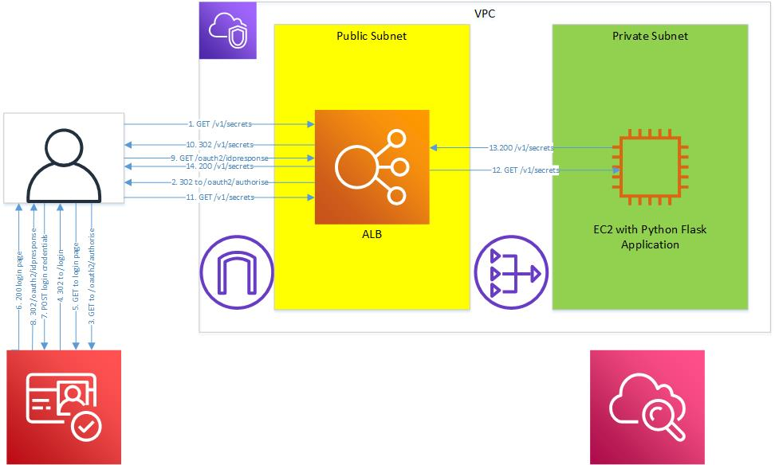

# cognito-learning
This is a learning tool for examining how AWS Application Load Balancer, Cognito and a simple python flask application running on EC2 interact so that you can learn about the authentication and authorisation flows.

The python application has 4 URI you can invoke:

**/v1/public** - a list of public data
**/v1/secrets** - a list of secret information that requires an authenticated user
**/** - a default uri that displays a simple HTML page
**/logout** - a logout url that resets the ALB cookies

# Architecture

# Building the environment

First, create a VPC with a public and private subnet and a nat gateway.  Create an EC2 instance using the Amazon linux 2 image and pop it in the private subnet.  The EC2 instance should be managed by Systems manager and have the agent installed and running.  Ensure that you can use session manager to access the EC2 instance and that the instance can reach the internet.  The instance will also need a role that can write to CloudWatch.

Under the ec2-user home directory, install Python3 then create a venv environment.  Switch to the venv environment and upgrade pip.  Next, install the python packages flask, watchtower and waitress.

Create a target group using HTTP on port **5000**.  Create an Application Load Balancer listening on port 80 and routing to the target group.  Lastly, create a Cloudwatch agent log group called **cognito-learning** and a stream called **api**.

Fork this github repo to a new copy and switch to it.  Set up a deployment pipeline using your new github repo as the source, skip the build step and create a deployment to an EC2/On-prem instance.  The appspec.yml is already created and should work when the pipeline runs.

All things being equal, you should now have a python app runinng in a waitress container listening on port 5000.  The target group should update and the application load balancer become active.  Check that the /, /v1/public and /v1/secret uri's are all working.  The logs whould be goign to CloudWatch and the server.log in the ec2-user's home directory.

Next, set up DNS in Route 53 for your site.  Set up an SSL certificate for the site then create an https listener.  Set up http to forward to https on the ALB.  Set up Cognito to use a user pool and create application url redirects and logout url.  Edit the code in the app.py to take account of the new DNS name for your site.  Just search and replace the hostname part of any URL contained in the code.  Lastly, set up a new rule in the ALB to require authentication for /v1/secrets path, and use your newly created Cognito application as the target.  Forward the traffic to the target group if the logon is sucessful.

Now try the site again and this time you should see a logon page when you try to access the secrets page.  When loggedn in, you should see all the tokens in the CloudWatch logs.  You can grab them from there to decode them if you like or add more logging code to do that.

Next try the /logout link on the home page.  This will invoke the logout endpoint for Cognito as well as running the logout api on the server which invalidates the ALB cookies.  Check that the cookies have expired and that you are required to logon again should you see the /v1/secrets page.

Note that it is possible to invalidate the cookies using the /logout api call without first invoking the COgnito logout endpoint.  This doesn't really log you out and on the next run to the /v1/secrets page you will get a new cookie from the ALB!

# OAuth authentication flow

As per the diagram, you will observe several requests and response in the browser developer tools as you try to hit a page that requires authentication.

1. Browser executes a **GET** on the resource **/v1/secrets**.
2. The load balancer recognises a path that requires authentication and sends a **302** to the **/oauth2/authorise** endpoint that contains the **client_id=whatever**, **redirect_uri=https://host/oauth2/idpresponse**, **response_type=code**,  **scope=openid** and **state**.
3. The browser then makes a **GET** to the **/oauth2/authorise** endpoint.
4. The authorize endpoint gets the request and sends a **302** to the **/login** endpoint using all the information above.  It also sets the **XSRF-TOKEN**, **crsf-state** and **crsf-state-legacy** cookies.
5. The broswer sends a **GET** to the **/login** endpoint with all of the headers including the new cookies it received from the **/oauth2/authroize** endpoint.
6. The login endpoint responds with a **200** for the login page.
7. The browser executes a **POST** and sends the user credentials **/login** endpoint along with the cookies it got from the **/oauth2/authrpize** endpoint.
8. The **/login** endpoint authenticates the user, and sends a **302** to the **/oauth/idpresponse** endpoint.  It also expires any existing **XSRF-TOKEN** cookie, then sets the **XSRF-TOKEN** and **Cognito** cookies. The **302** also includes the **code** and **state**.
9. The browser executes a **GET** to the **/oauth2/idpresponse** endpoint with the **code** and **state**.
10.  The **/oauth2/idpresponse** endpoint which is the ALB, responsed with a **302** to the resource **/v1/secrets** and the **AWSELBAuthSessionCookie**.  
10. The Browser does a **GET** on the resource, presents the **AWSELBAuthSessionCookie** cookie and the request is processed by the EC2 instance python app which sends back a 200 via the ALB.  Easy!

When you refresh the secrets page the following steps happen:

1. Browser executes a **GET** on the resource **/v1/secrets** with the ALB cookie.
2. ALB sends a **302** to the **/oauth2/authorise** endpoint.
3. The browser executes a GET to the **/oauth2/authorise** endpoint, this time sending cookies **Cognito, XSRF** and **congnito-fl**. Not sure where they came from, but must be the **/oauth2/authorise** endpoint.
4. The **/oauth2/authorise** endpoint responds with a **302**** to the **/oauth2/idpresponse** endpoint and the sets the value of **code**.
5. The browser executes a **GET** on the redirect to the **/oauth2/idpresponse** endpoint with the **AWSELBAuthSessionCookie** cookie and the **code** the **state**.
6. The **/oauth2/idpresponse** endpoint sends a **302** to the **/v1/secrets** and may also reset a new **AWSELBAuthSessionCookie** cookie.
7. The broswer executes a GET on the resource **/v1/secrets**.

Next, lets see what happens when we execute the Loug out procedures using the proper logout link.

1. Browser clicks on the logout href to which executes the following **GET** request **https://sams-test-site.auth.us-east-1.amazoncognito.com/logout?client_id=6uri15vh9sig0e0j3fimc656m6&logout_uri=https://sams-test-site.com/logout**.  The request also sends the cookies **Cognito**, **XSRF-token**, **csrf-state**, **csrf-state-legacy** and **congnito-fl**.
2. The **/logout** cognito endpoint responds with a **302** to the **/logout** api endpoint.  It also sets the **Cognito**, **XSRF-token** cookies to expired.
3. The browser executes the **GET** on the **/logout** api endpoint and sends the **AWSELBAuthSessionCookie** cookie.
4. The /logout api respons with a **200** and the **AWSELBAuthSessionCookie** has been expired.

Now, to access the /v1/secrets page again you will be redirected to the login page.

Supposing we are already logged in and you execute the /logout api call but without actually invoking the Cognito /logout endpoint, then this happens:

1. Browser executes a GET on the **/logout** api, passing the **AWSELBAuthSessionCookie** cookie in the request headers.
2. The **/logout** api reponds with a 200 and the **AWSELBAuthSessionCookie** cookie has been expired.
3. Click on the **/v1/secrets** api call and note what happens now.
4. The load balancer recognises a path that requires authentication and sends a **302** to the **/oauth2/authorise** endpoint that contains the **client_id=whatever**, **redirect_uri=https://host/oauth2/idpresponse**, **response_type=code**,  **scope=openid** and **state**.
5. The browser executes a **GET** on the **/oauth2/authorise** endpoint and **oh dear** it has still got the cookies **Cognito**, **XSRF-token**, **csrf-state**, **csrf-state-legacy** and **congnito-fl** so these are sent along with the request.
6. The **/oauth2/authorise** endpoint sends a **302** to the **/oauth2/idpresponse** endpoint with a **code** and **state** set in the redirect url!  The header **x-amz-cognito-request-id** is also set.  not sure what that is.
7.  The browser executes a **GET** on the **/oauth2/idpresponse** endpoint with a **code** and **state** set in the redirect url.
9.  The **/oauth2/idpresponse** responds with a **302** to the **/v1/secrets** page with a new **AWSELBAuthSessionCookie** cookie.
10. The Browser executes a **GET** on the **/v1/secrets** resource with the new **AWSELBAuthSessionCookie** cookie.
11. The EC2 instance sends back a **200** and the resource.

The key problem here is the cookies at step 4 **Cognito**, **XSRF-token**, **csrf-state**, **csrf-state-legacy** and **congnito-fl** are not expired so the authorize endpoint sends a valid **code** and **status** to the browser.  Those cookies are not set by the initial **302** response from the ALB to the browser, unless they are hidden in the **state** header but I don't think so.  I guess the browser must store them hidden somewhere and only uses them or sees them when it issues the **/oauth2/authorise** request.  Because the **/oauth2/authorize** request is sucessful, the **302** has a valid **code**  and **state**, which the ALB accepts and responds with a new ALB session cookie.  The key point of hack here is to have a valid **code** and **state** when hitting the ALB.